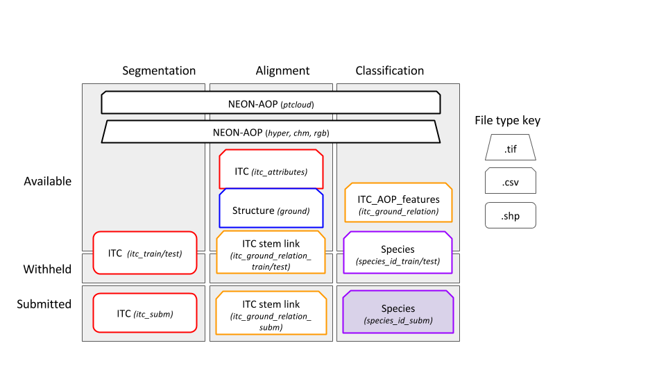
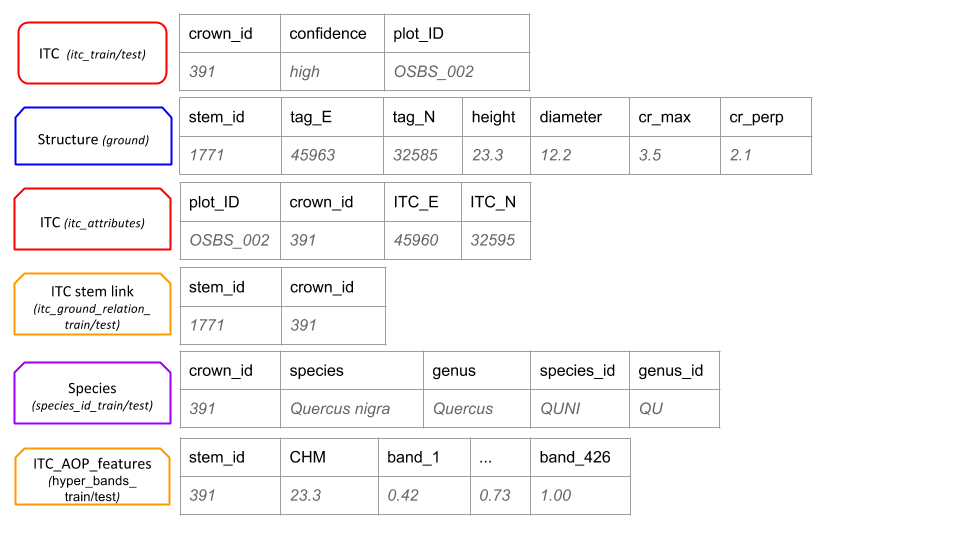

### Download

All of the necessary data for all three tasks is available in a single 700 MB
zip file:

[https://doi.org/10.5281/zenodo.867646](https://doi.org/10.5281/zenodo.867646)

The remote sensing data is stored in the `RSdata` folder of the archive with
subfolders for each datatype described below. Data for specific tasks is
available in folders named `Task1`, `Task2`, and `Task3`.

### Datasets

Seven datasets will be used as part of this evaluation:

* Remote Sensing Data -- 43 plots totalling ~1GB of imagery
   * NEON Photographs - 0.0625 m2 resolution photographic images (RGB) in
     `ECODSEdataset/RSdata/camera`
   * NEON LiDAR data - 3-dimensional point clouds of the height of trees and
     ground in `ECODSEdataset/RSdata/pointCloud`, which are also provided as 1
     m2 resolution raster images of the estimated height of vegetation above the
     ground (Canopy Height Model; CHM) in `ECODSEdataset/RSdata/chm`.
   * NEON Hyperspectral images - 1 m2 resolution raster images with 426
     wavelength bands from 380-2510 nm in `ECODSEdataset/RSdata/hs`. These data
     are georectified and atmospherically corrected, and bands that are strongly
     influenced by the absorbance by atmospheric water (and should be removed in
     most cases) will be specified.
* Ground Data -- 88 trees
   * NEON Vegetation Structure data - Ground based positions of individual
     trees, the size of each trunk, and for some trees two measurements of crown
     size (maximum crown diameter and the diameter of the crown perpendicular to
     the axis of the maximum diameter)
   * NEON Species Data - the genus and species (type) of each tree
* Individual Tree Crown segmentations (ITC) Data -- 626 stems
   * ITC data - Vector polygon data of tree crown boundaries and vector point
     data of trunk locations both mapped in the field directly onto remote
     sensing images. Boundaries and locations are drawn onto remote sensing
     images from the ground while observing the trees directly and then fine
     tuned to match clear crown edges in the images. The crown data include
     confidence scores qualitatively estimating the precision of the tree crown
     mapping.
   * Correspondence between ITC crowns and ground stems Spatial data will be
     provided in the UTM 17N coordinate system. The projection can generally be
     ignored at this scale of analysis and x and y values treated as any
     standard grid.  Figure 1 illustrates these core data types. All data
     collected by NEON are publicly available with open licenses. The subset of
     data needed for this DSE will be posted on the DSE website for download.

*Figure 1. Example data products provided in the contest. Top row represents the
remote sensing data: a) is the RGB image of a 80x80m plot, b) a CHM for the same
region, c) a representation of the Hyperspectral data in false colors (a mixture
of 3 hyperspectral bands; R = band 19, G = band 34, B = band 58). d) represents
vectorial spatial data: green polygons ITCs collected for the area, black dots
NEON ground data, dots’ size is scaled by tree DBH. Red ellipse represent
expected crown area, given the widest crown diameter and its orthogonal one. e)
is a sample of the attributes associated to ground data. f) is an example of
spectral signature for a given hyperspectral pixel.*

### Location

All data is from the Ordway-Swisher Biological Station (OSBS) NEON site. Field
measures and remote sensing data are for 23 OSBS NEON distributed plots (1600
m2) and 20 OSBS NEON tower plots (1600 m2), which include hardwood/woody
wetlands and upland pine/sandhill ecosystems.

### Input/Output data types for each tasks

The segmentation task uses the remote sensing data and 70% of ITC stem data for
training and 30% of the ITC stem data for testing. The alignment task uses the
remote sensing data, the ITC data, and ground data on stem diameter, height, and
location. This task uses only trees whose ITCs are in the training set of the
segmentation task with 70% of those stems used for training and 30% for
testing. The classification task uses the subset of remote sensing pixels
falling within the ITC-stem polygons. Data are in tabular form, with each row
representing a pixel of the remote sensing data. Features for each pixel include
ID, height, and reflectance for the 426 hyperspectral bands. A different csv
file contains species identification for 70% of the ITCs for which species has
been identified. The remaining 30% of species identification data is held as
testing.

*Figure 2: Training/testing Input/output data types for each of the three
tasks. Data in both the train and test boxes will be split either at the plot
level (segmentation and alignment tasks) on the stem level with 70% of the
plots/stems used for training and 30% for testing. Products to be submitted are
for the test data.Names in italics correspond to the names of the files provided
or to be submitted. NEON-AOP (black): Spatial data of the 4 types of NEON-AOP
data. ITC (red): Spatial data of Individual Tree Crowns and a unique crown ID
number. ITC stem link (orange): Table of unique crown ID number and the NEON
ground data stem ID number. Structure (blue): Table of NEON ground data with
tree stem attributes; unique stem ID, latitude & longitude coordinates, stem
diameter, crown dimensions. Species (purple): Table of NEON ground data with
assignment to two class categories (species class and genus class). Species
product is a table of the probability of assignment of each ITC for each class
in both class categories.*
